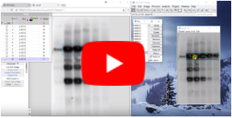
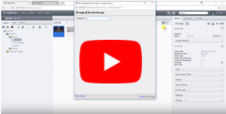
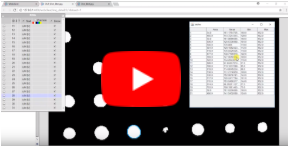

[](https://github.com/imagej/imagej-omero/actions/workflows/build-main.yml)
[](https://imagesc.zulipchat.com/#narrow/stream/327236-ImageJ2)

[ImageJ-OMERO Presentation Slides](https://imagej.github.io/presentations/2018-05-30-imagej-omero/#/)

## Overview

This project provides interoperability between
[ImageJ](http://imagej.net/) and the [OMERO server](http://imagej.net/OMERO).

ImageJ-OMERO is ___one of two___ official integration mechanisms combining the
two tools. The other project is
[OMERO.imagej](https://omero-guides.readthedocs.io/projects/fiji/en/latest/).

The two mechanisms work differently and have different features:

* __ImageJ-OMERO__ is built on ImageJ2. It is maintained by the ImageJ team.
  You can install it using one of the OMERO-x.y update sites, replacing `x.y`
  with your version of the OMERO server. The paradigm is to download complete
  5-D images from OMERO as ImageJ2 datasets, with blocks of pixels loaded on
  demand via the ImgLib2 cached cell image mechanism. It also supports
  transferring ROIs to/from OMERO as
  [imglib2-roi](https://github.com/imglib/imglib2-roi) objects, and results
  tables to/from OMERO as
  [scijava-table](https://github.com/scijava/scijava-table) objects.

* __OMERO.imagej__ is built on ImageJ 1.x. It is maintained by the OMERO team.
  It must be installed manually; it does not have an ImageJ update site. The
  plugin is a thin wrapper of the OMERO.insight client, enabling you to connect
  to OMERO via the OMERO.insight GUI, browse your database as usual, and send
  images to ImageJ on demand. There is no direct support for translation of
  ROIs or tables; the supported workflow is to do your analysis in ImageJ as
  usual, then upload ROIs and results tables as attachments on the OMERO side.

A third way to integrate OMERO with ImageJ, if you are comfortable writing
scripts, is via [PyImageJ](https://github.com/imagej/pyimagej), as [described
in the OMERO
documentation](https://omero-guides.readthedocs.io/en/latest/fiji/docs/imagej_python.html).

Which approach works best for you will depend on your requirements. For help,
please post on the [Image.sc Forum](https://forum.image.sc/) using the `imagej`
and `omero` tags.

## ImageJ commands for working with OMERO

There are ImageJ commands for accessing images from a remote OMERO server,
as well as uploading image data from ImageJ to OMERO as a new image.

### Installation

To try it out, enable the appropriate
[update site](http://imagej.net/Update_Sites):

* __OMERO-5.4__ If your OMERO server is version 5.4.x.
* __OMERO-5.2__ If your OMERO server is version 5.2.x.
* __OMERO-5.1__ If your OMERO server is version 5.1.x.
* __OMERO-5.0__ If your OMERO server is version 5.0.x.

You will then have the following new menu items:

* File > Import > OMERO...
* File > Export > OMERO...

### OMERO Setup

If you do not already have access to a local OMERO server, the quickest method
to get one up and running is [to use the Docker
example](https://github.com/ome/docker-example-omero). This will create a
server + web client.

### Demonstration Video

[](https://www.youtube.com/watch?v=st1E9Qxu0-s)

## Calling ImageJ commands as OMERO scripts

You can execute ImageJ modules (commands, scripts, etc.) on the server side as
OMERO scripts.

Currently images, tables, and ROIs are supported. However, only ROIs can be
updated on the server. Images and tables must be uploaded as new objects.

Additionally, it is possible to dictate where in OMERO outputs get stored by
using special parameter properties.

*   `attachToOMERODatasetIDs` - This is used for output images to specify which
    OMERO Datasets they should be associated with. The OMERO Dataset must be
    specified by ID, and each output image can be associated with multiple
    OMERO Datasets.
*   `attachToImages` - This is used to dictate to which **input images** output
    ROIs/tables should be attached. These images must be inputs to the script,
    and should be referenced by their name (not ID).

If you wish to give it a test drive, the steps are:

### Prerequisites

*   [OMERO 5](http://www.openmicroscopy.org/site/support/omero5/sysadmins/unix/server-installation.html)
*   Python 2.7 or later

### Installation

Download the
[ImageJ-OMERO installer](https://raw.githubusercontent.com/imagej/imagej-omero/master/bin/install-imagej),
and run it:

```shell
sh install-imagej <path/to/omero>
```

The installer will:

*   Download and install ImageJ into OMERO's `lib/ImageJ.app` folder,
    with the __Fiji__ and __OMERO-5.x__ update sites enabled.
*   Install OMERO script wrappers for all available ImageJ commands
    into OMERO's `lib/scripts/imagej` folder.

### Using an existing ImageJ installation

If you already have ImageJ installed on the OMERO server machine,
you can use that, rather than installing a new copy of ImageJ:

1.  Enable the __OMERO-5.x__ [update site](http://imagej.net/Update_Sites).

    ```shell
    <path-to-imagej>/<imagej-launcher> --update add-update-site OMERO-5.x http://sites.imagej.net/OMERO-5.x
    <path-to-imagej>/<imagej-launcher> --update update-force-pristine
    ```

    Where x is your OMERO version, &lt;path-to-imagej&gt; is a path to your ImageJ directory (i.e. ImageJ.app or Fiji.app), and &lt;imagej-launcher&gt; is the launcher for your operating system (i.e. ImageJ-linux64)

2.  Run `gen-scripts` in ImageJ's `lib` directory.

### Take it for a spin

*   Fire up OMERO:

    ```shell
    omero admin start
    ```

*   List available scripts:

    ```shell
    omero script list
    ```

*   List parameters of "System Information" command:

    ```shell
    omero script params $(omero script list | grep 'System_Info' | sed 's/|.*//')
    ```

*   Execute the "System Information" command:

    ```shell
    omero script launch $(omero script list | grep 'System_Info' | sed 's/|.*//')
    ```

*   Repeat with any other desired commands.
    Also try from OMERO.web and OMERO.insight!

### Uninstalling

If you wish to remove ImageJ support from OMERO:

```shell
OMERO_PREFIX="/path/to/omero"
rm -rf "$OMERO_PREFIX/lib/scripts/imagej" "$OMERO_PREFIX/lib/ImageJ.app"
```

### Demonstration Videos

[](https://www.youtube.com/watch?v=gpu2NdidBHQ)

[](https://www.youtube.com/watch?v=CQP_cIYt00U)

## Under the hood: a SCIFIO format for OMERO data

This component provides a [SCIFIO](http://imagej.net/SCIFIO) `Format`
implementation which offers transparent read and write access to image pixels
on an OMERO server.

With this format implementation, SCIFIO's `ImgOpener` class can be used to
"open" (i.e., download on demand) an ImgLib2 `ImgPlus` directly from an OMERO
server. The `ImgPlus` will be backed by a `SCIFIOCellImg`, which is backed by
an `OMEROFormat.Reader`, which is backed by an `omero.client` connection.

The `ImgPlus` can then be wrapped as an ImageJ2 `Dataset`, enabling ImageJ2
commands to operate upon it directly.

When changes are made to the local `ImgPlus`'s pixels, those changes happen in
memory, to the `Img`'s "cells"; i.e., paged blocks. As new cells are requested
which push memory consumption beyond desired limits, old dirty cells are cached
out to disk. These cached cells, when present, are used in preference to data
from the original source. In this way, it is possible to iterate over a massive
remote dataset and apply image processing filters, with all changes recorded to
the disk cache, as long as there is sufficient disk space.

Finally, once processing is complete, SCIFIO's `ImgSaver` class can be used to
"save" (i.e., upload) the `ImgPlus` back to OMERO as a new pixels object.
